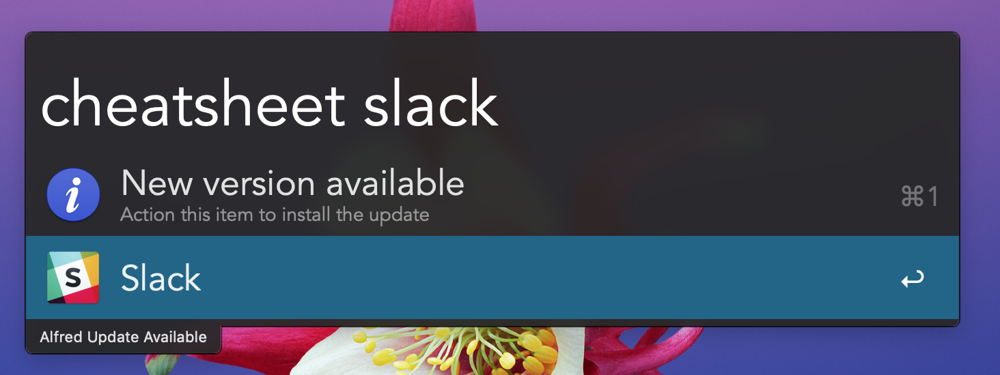
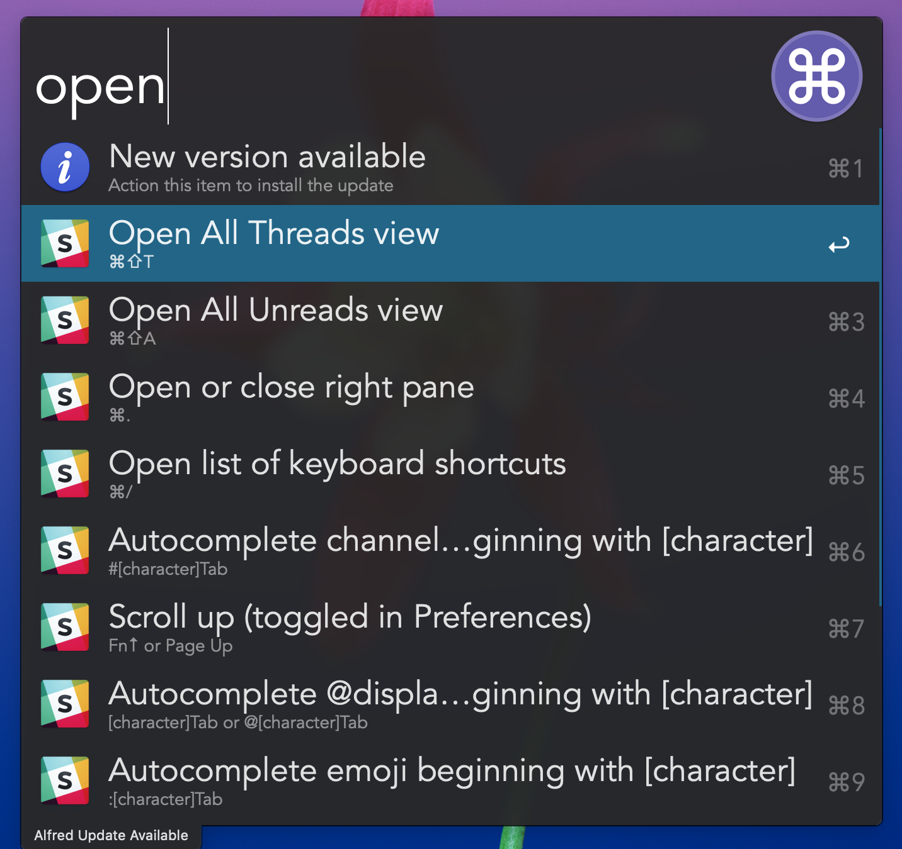
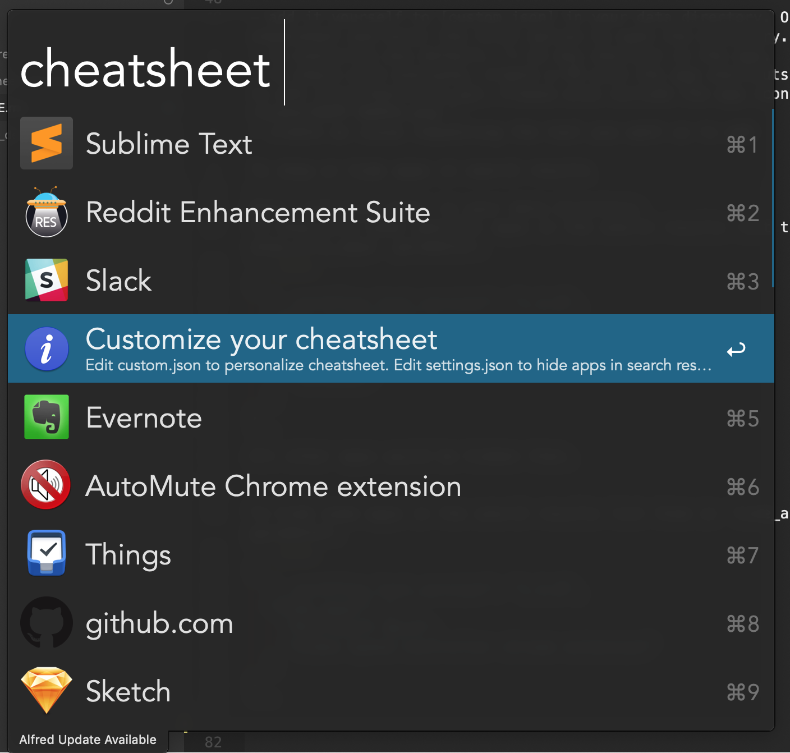

Cheatsheet
----------

Alfred workflow that gets shortcuts for applications, websites, tools and others

If you have any questions or issues, checkout the discussion at [the alfred forum here](https://www.alfredforum.com/topic/10830-cheatsheet-shortcuts-for-your-tools/).
Or create an issue if you cannot find an answer.





Supported
---------
- Airmail
- Alfred
- Asana
- AutoMute Chrome extension
- Default Folder X
- Evernote
- Finder
- Firefox
- Forklift 3
- Github.com
- Google Chrome
- Google Sheets
- inbox.google.com
- IntelliJ Idea (default Mac OS X)
- iTerm2
- Mac OSX
- Microsoft Excel
- Microsoft Word
- Outlook
- Reddit Enhancement Suite
- Safari
- Slack
- Sublime Text
- Terminal
- Trello.com
- Things
- Video Speed Controller chrome extension
- Vim
- Vintage Sublime
- Visual Studio Code
- Youtube.com

Request apps to add
----------------
If you would like to request an app to add, please comment on this issue [#17](https://github.com/mutdmour/alfred-workflow-cheatsheet/issues/17)

To download
-----------
Download [workflow file](https://github.com/mutdmour/alfred-workflow-cheatsheet/raw/master/Cheatsheet.alfredworkflow)

To add more apps
----------------
- add it yourself to [custom.json] in your data directory.
```json
{
  "custom_app_example": {
    "action": "shortcut"
  }
}
```
- to overwrite any default, ^⏎ on any shortcut in the app.
- to share with everyone, create a PR with the app shortcuts you want to add [/src/shortcuts.py]. Please also include the app icon (`src/apps/icons/%APP NAME%.png`).
- create an issue requesting the tool you want us to add

To show or hide apps in search results
----------------
Open `settings.json` in your data directory.

To show only some specific apps in the search results list them in `show_only_apps` parameter:
```json
{
  "__workflow_last_version": "1.3.0",
  "show_only_apps": [
    "Alfred",
    "Mac OSX",
    "Terminal"
  ]
}
```
All other apps would be hidden then.


To hide some apps in the search results list them in `hide_apps` parameter:
```json
{
  "__workflow_last_version": "1.3.0",
  "hide_apps": [
    "Microsoft Word",
    "Video Speed Controller chrome extension"
  ]
}
```

To find your settings.json or custom.json file
----------------

Open cheatsheet in Alfred and look for `customize your cheatsheet`.
Open that and that should open the folder with your `settings.json` and `custom.json` file.


